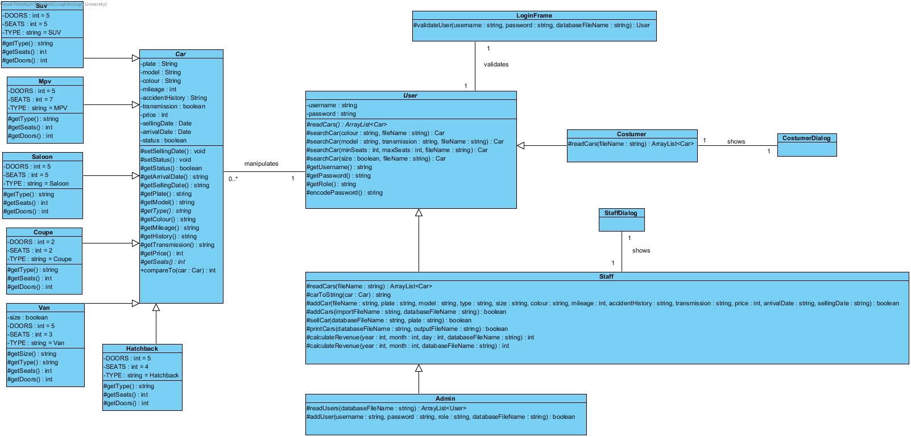

# Car-dealership
Car dealership system for costumers, staff and administrators developed using java and an object oriented approach (see the class diagram below).

This system allows the users to do the following

Admins:
- Add users into the system
- Has all functionality that the staff role has

Staff:
- Add cars into sytem database through a file
- Add a car into the system database
- Sell cars
- Print cars into a file, sorting the cars by sold and unsold and by their respective selling date
- Search for cars
- Calculate revenue by day or month

Customer:
- Can do the same search as staff users, but not having access to accident history information

Class Diagram

